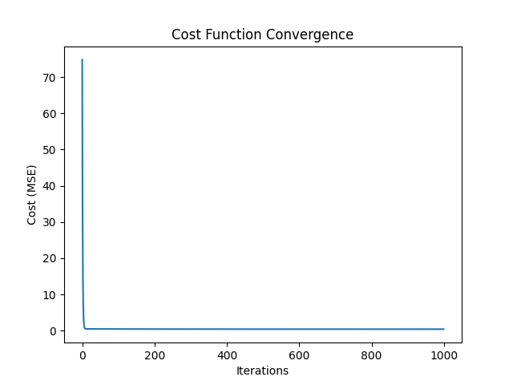
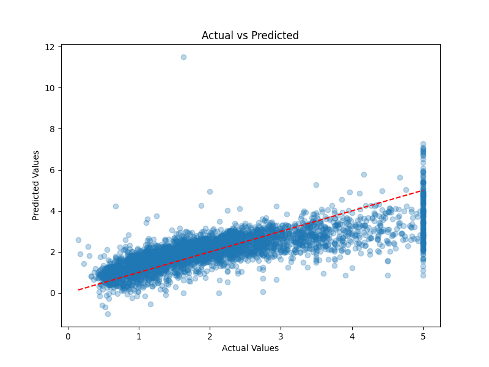
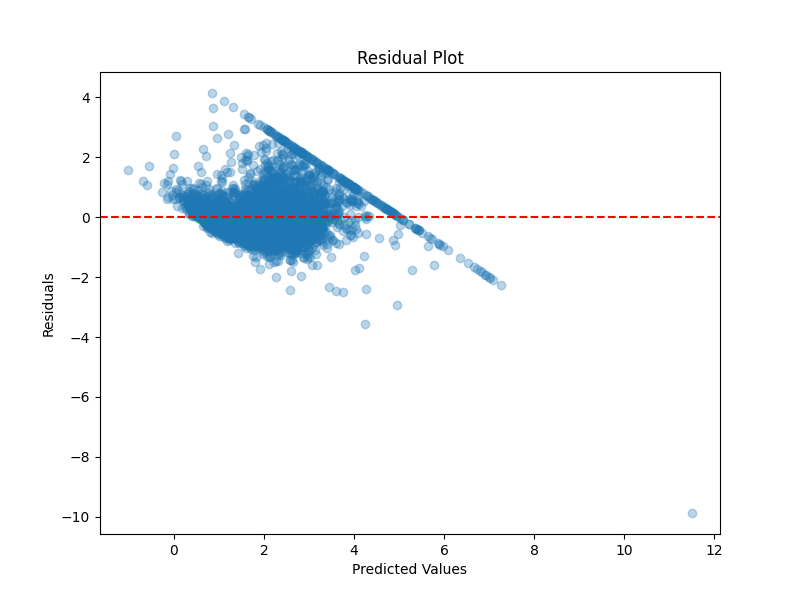
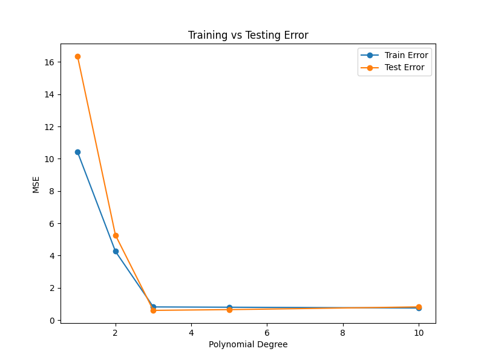

# Machine Learning Internship – Week 3
## Regression Models, Overfitting & Model Persistence

Welcome to the documentation for Week 3 of my ML Internship. This week was dedicated to mastering the core mechanics of regression, diagnosing model behavior (Bias vs. Variance), and implementing industry-standard deployment practices.

---

## Overview of Tasks
The focus was on moving from high-level APIs to internal mechanics and understanding how to make models production-ready.
* **Linear Regression from scratch:** Mathematical implementation of Gradient Descent.
* **Multiple Linear Regression:** Handling multi-dimensional data with `sklearn`.
* **Polynomial Regression:** Analyzing model complexity and the overfitting phenomenon.
* **Model Persistence:** Strategies for saving and loading trained models.

---

## Task 3.1: Linear Regression from Scratch
**Objective:** To understand the internal optimization process without using pre-built libraries.

* **Logic:** Implemented a custom class featuring Weight & Bias initialization.
* **Optimization:** Manual Gradient Descent to minimize the Mean Squared Error (MSE).
* **Metrics:** Custom calculation of $R^2$ Score.

| Regression Line | Cost Convergence |

|  |  |

---

## Task 3.2: Multiple Linear Regression (sklearn)
**Objective:** Applying regression to real-world datasets using industry-standard tools.

* **Dataset:** California Housing Dataset.
* **Evaluation:** Comprehensive analysis using MAE, MSE, RMSE, and $R^2$.
* **Key Insight:** Residual plots were used to identify if the linear assumption holds true for the dataset.

| Actual vs. Predicted | Residual Analysis |

|  |  |

---

## Task 3.3: Polynomial Regression & Overfitting
**Objective:** Visualizing the Bias-Variance tradeoff through varying model degrees.

* **Analysis:** Comparison of degrees 1, 2, 3, 5, and 10.
* **Outcome:** * **Underfitting:** Seen in Degree 1 (High Bias).
    * **Overfitting:** Seen in Degree 10 (High Variance/Low Generalization).
    * **Optimal:** Degree 3 provided the best fit for the synthetic dataset.

| Model Comparison | Learning Curves |

|  |  |

---

## Task 3.4: Model Persistence
**Objective:** Learning how to bridge the gap between training and production.

I compared three major formats for saving and loading models:

| Format | File Size | Load Time | Best For |

| **Pickle (.pkl)** | 434 bytes | 0.0s | Standard Python objects |
| **Joblib (.joblib)** | 576 bytes | 0.0s | Large NumPy arrays/ML models |
| **JSON** | 62 bytes | 0.0s | Lightweight, cross-platform weights |

---

## Final Learning Summary
By completing these tasks, I have developed a strong intuition for:
1.  How **Gradient Descent** updates parameters to reach the global minimum.
2.  How to use **Residual Plots** to diagnose model health.
3.  The critical importance of **Generalization** (avoiding overfitting).
4.  How to efficiently **Serialize** models for real-world application.

---

### Tools & Libraries
`Python` • `NumPy` • `Matplotlib` • `Scikit-Learn` • `Pickle` • `Joblib`

**Author:** Hassan Raza  
*Machine Learning Intern*
